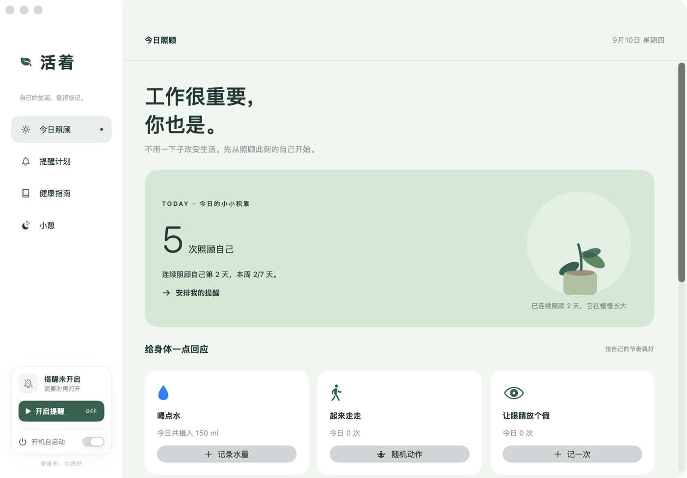

# 活着

一款给 macOS 打工人的轻量健康提醒应用。工作很重要,你也是。



## 功能

### 温和提醒
- 喝水、起来走走、远眺休息三类居中浮窗提醒;喝水与起来走走默认开启,远眺默认关闭
- 间隔 15–120 分钟七档可调,修改即时生效且只重启被改的那一项
- 同一时刻多个提醒到期时依次排队展示,不互相打架;文案每次轮换
- 喝水浮窗可选 150/250/350/500 ml 直接记录;运动浮窗随机推荐办公室动作并带动画示意
- 「起来走走」带闲置检测:你不在电脑前时计时暂停,回来再提醒

### 节奏与时段
- 工作时段感知:只在设定时段内提醒,午休可静默,周末可整体不提醒;时段外的提醒顺延到下一个窗口,不会丢
- 自适应节奏:某项提醒今天被推迟太多次时,温和建议放宽一档,不悄悄改设置

### 今日照顾
- 一键打卡与今日统计(次数、饮水量)、可撤销的今日足迹
- 跟随连续天数成长的小植物,今天打卡会长出新叶
- 回望:近 7/30 天照顾次数柱状图、日均饮水、连续天数

### 白噪音小憩
- 独立小憩页,30 种白噪音(雨声、自然、动物、场所、器物五类)
- 试听、音量、3/5/10/15 分钟时长;小憩中有呼吸圆引导,结束自动淡出并记一次照顾
- 上次选择的声音、音量、时长会被记住

### 常驻与自启
- 菜单栏快捷打卡、暂停/开启提醒、打开主窗口
- 关闭主窗口后隐藏 Dock 图标,计时继续;完全退出后停止
- 支持开机自启动(系统登录项)

## 运行

使用 Xcode 26 或更新版本打开 `Live.xcodeproj`,选择 `Live` scheme 运行。提醒由应用自己的浮窗展示,不需要 macOS 通知权限。支持 macOS 14 及以上。

数据只保存在本机 `UserDefaults`,不依赖网络。

## 打包

```bash
./make-dmg.sh        # Release 构建 → live-v<版本>.dmg
```

DMG 内含应用与 `/Applications` 快捷方式,拖拽即装。个人 Apple ID 打的包未做公证,发给他人时对方需在 系统设置 › 隐私与安全性 中放行一次。

## 内容来源与声明

- 白噪音音频来自 [Tosencen/XMSLEEP](https://github.com/Tosencen/XMSLEEP)(Unlicense 公有领域),已转为 AAC 打包进应用
- 健康指南内容参考 [eternity4719/HowToLiveBetter](https://github.com/eternity4719/HowToLiveBetter)(Unlicense)
- 应用中的提醒与建议仅供一般健康参考,不替代专业医疗意见
